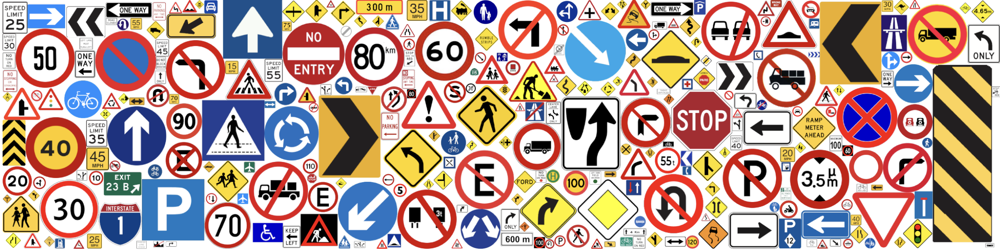

# Traffic Signs Detection on MTSD using RT-DETR

This repository builds an end-to-end road sign detection pipeline on the [Mapillary Traffic Signs Dataset (MTSD)](https://www.mapillary.com/dataset/trafficsign) using [RT-DETR](https://docs.ultralytics.com/models/rtdetr/). The workflow combines label normalization, tiled training, and SAHI-based inference to improve detection of small and distant traffic signs in high-resolution street scenes.

## Overview

Traffic sign detection on street-level imagery is challenging because many signs occupy only a small number of pixels, while the background dominates the image. It addresses that setting with three main ideas:

- Label normalization to reduce MTSD class fragmentation.
- Tiled training at 1024×1024 resolution to improve small-object visibility.
- SAHI-based sliced inference to preserve local detail at test time.

## Dataset

We use the Mapillary Traffic Signs Dataset (MTSD), a large-scale benchmark for fine-grained traffic sign detection and classification.

- 52k+ street-level images.
- 401 original traffic sign classes.
- Large scale variation, geographic diversity, and long-tail imbalance.
- Fine-grained class variants across countries and sign styles.

Dataset link:
https://www.mapillary.com/dataset/trafficsign

## Method

### 1. Label Normalization
MTSD contains many visually different variants of semantically similar signs. This project removes the final group suffix from labels to reduce label explosion.

Example:

`complementary--chevron-left--g3` → `complementary--chevron-left`

This reduces the number of classes from 401 to 257.

### 2. Tiled Training
Instead of training directly on full-resolution images, each image is sliced into overlapping 1024×1024 tiles. This increases the object-to-background ratio and gives the detector stronger supervision on small traffic signs.

### 3. RT-DETR Fine-Tuning
The model is fine-tuned using the Ultralytics RT-DETR implementation on the tiled dataset.

### 4. SAHI Inference
At inference time, SAHI is used to run sliced prediction on large images. This helps preserve local spatial detail and improves small-object recall compared with standard full-image inference.

## Results

The training run shows stable localization learning and meaningful qualitative performance on validation images and video.

Reported validation results from the notebook:

- **Precision**: about 0.44
- **Recall**: about 0.33
- **mAP@50**: about 0.33
- **mAP@50-95**: about 0.28

A key qualitative finding is that SAHI improves detection of small and distant signs that are often missed after full-image resizing. In the notebook example, a `regulatory height restriction limit` sign that is misclassified under standard inference is recovered with higher confidence using sliced inference.

## Key Findings

- RT-DETR learns localization effectively on tiled traffic-scene data.
- The main bottleneck remains fine-grained classification.
- Recall is the limiting factor, indicating missed detections are a primary source of error.
- SAHI substantially improves small-object inference quality.
- The main tradeoff is increased inference latency.

## Limitations

- Fine-grained confusion remains high for visually similar classes.
- Long-tail class imbalance affects rare categories.
- SAHI improves recall but increases inference cost.
- Real-time deployment will require additional optimization.

## Future Work

- Improve recall and reduce false negatives.
- Apply stronger long-tail balancing strategies.
- Explore better fine-grained classification heads or losses.
- Optimize sliced inference for lower latency.
- Evaluate on broader real-world driving video.

## Acknowledgment

- RT-DETR via [Ultralytics](https://docs.ultralytics.com/).
- [SAHI](https://github.com/obss/sahi) for sliced inference.
- [Mapillary](https://www.mapillary.com/) for MSTD road sign annotations.